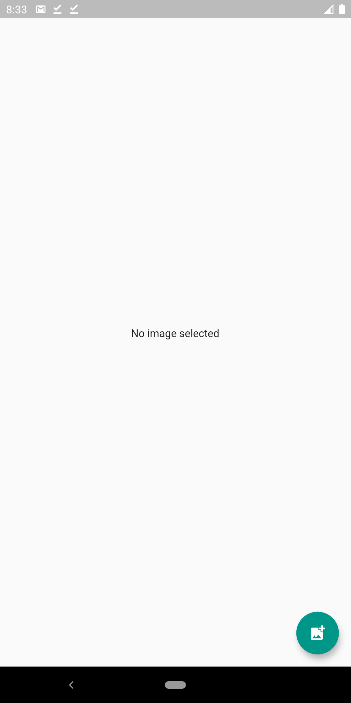
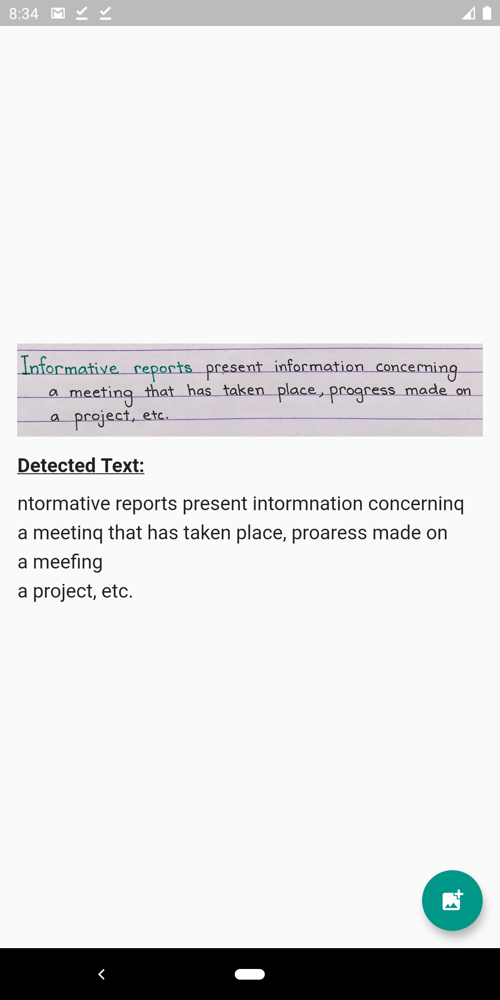

# Firebase OCR

A simple flutter application that uses Firebase ML Vision to detect text from an image.

## Screenshots

| No Image | Detected Text |
| --- | --- |
|  |  |

## Steps to Reproduce

1. Clone this project.
2. Follow [this](https://firebase.flutter.dev/docs/) to setup Firebase for the Flutter project. **Remember to download the google-services.json file into the /android/app/ directory.** 
3. Run, tweak and have fun.